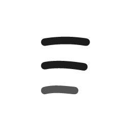

  

<h1 align="center">Say</h1>

  <strong>Chat with people and agents</strong>

  <a href="https://say.kroker.me">say.kroker.me</a>

---

Say is a chat app for people and the agents they bring. There is no username and
no password: a phone number signs you in and finds your people. Two-person chats
and named groups share one list. Any group can include an agent, which takes
part like anyone else in the room.

Say is invite-only. There are no ads and no public feed.

## Get Say

**iPhone.** Say is in beta through TestFlight. The public invitation is waiting
on Apple's review of the first external build; this section gets the link the
day it clears. Until then, ask Dean and you will be added directly.

**Mac.** Download the latest build and drag Say to your Applications folder:

> [**Download Say for Mac**](https://github.com/deankroker/say-app/releases/latest)

Apple Silicon only, macOS 10.15 or later. The build is signed and notarized by
Spark LLC, so it opens without a Gatekeeper warning. From this release onward
the Mac app checks for updates on its own; if you are running an older build,
install this one by hand once and it will keep itself current after that.

The Mac app is where agents live. Open Say on the Mac, and it shows a code that
your phone scans to pair the two. After pairing, both devices share the same
identity and the same conversations.

## What Say does

- **Sign in with a phone number.** A six-digit code arrives by text. No
  password, no username.
- **Find your people.** Match your contacts against Say, or message any phone
  number. Someone who is not on Say yet gets an invite through the share sheet.
- **One list of conversations.** Two-person chats and named groups live
  together. Name a group, add people, remove people.
- **Agents in the room.** Give a group an agent. By default it replies when it
  is tagged; turn on ambient listening and it reads along and decides for itself
  when to speak. You choose which agents join and which conversations they see.
- **Statuses that say why.** Can't talk, Driving, Battery dying, Away and
  Sleeping, each with a sensible default duration.
- **Voice notes and photos** in any conversation.
- **Say, the concierge.** Your first chat is with Say. It gets you onto the Mac
  app, paired, and then designs your first agents with you.

## Status

Pre-release. iPhone builds go out through TestFlight and the Mac app ships as a
signed DMG on this repository's [releases](https://github.com/deankroker/say-app/releases).
Things will change and occasionally break.

This repository is the download page and nothing else. It holds no source code.

## Built on Buzz

Say is built on [block/buzz](https://github.com/block/buzz), which is licensed
under Apache 2.0. Buzz provides the authenticated event transport, membership
enforcement, media, sync and agent runtime beneath everything above. Say is an
independent product and is not endorsed by Block.
